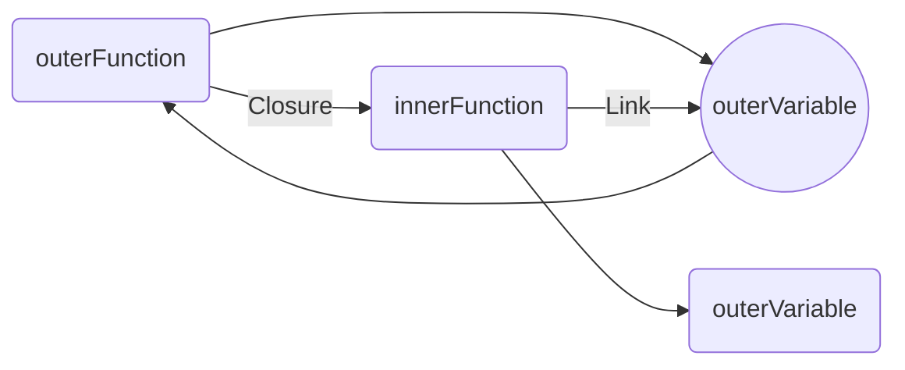
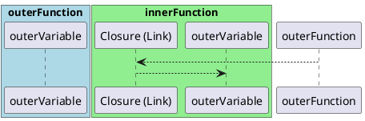

# Closure in JavaScript
- it enable us to not repeat calculations or tasks that take usually long time .

## introduction
- every time function runs it creates a new local memory.after finish running code (return the value/result) it delete the exception context of it.

Closure is a powerful concept in JavaScript that enables the creation of professional-level functions and optimization techniques.
It allows functions to remember data from previous executions and facilitates the implementation of design patterns.
Understanding closure involves grasping local memory,execution context, and functions with memories. In summary, closure empowers developers to build advanced functions, optimize performance, and enhance code structure.


## Returning Functions from Functions

Functions can be returned from other functions in JavaScript. This concept is crucial for understanding closure. When a function is returned from another function, it can be assigned to a variable and invoked later. The returned function retains access to variables and data from its outer function, even after the outer function has finished executing.

### Benefits of Closure

Closure allows for the creation of advanced functions and optimization techniques. By returning functions and capturing their surrounding data, closure enables powerful functionalities such as memoization and state management. It enhances code modularity, reusability, and performance.

### Example

Here's an example that demonstrates closure in JavaScript:

```javascript
function outerFunction() {
  const outerVariable = 'Hello';

  function innerFunction() {
    console.log(outerVariable);
  }

  return innerFunction;
}

const myFunction = outerFunction();
myFunction(); // Output: Hello
```

In this example, the `innerFunction` is returned from the `outerFunction`. Even though `outerFunction` has completed execution, `innerFunction` retains access to the `outerVariable` through closure. Invoking `myFunction` logs the value of `outerVariable`, demonstrating the persistence of data via closure.

Closure plays a crucial role in various aspects of JavaScript development, including advanced function creation, design patterns, and performance optimization. Understanding and effectively utilizing closure can greatly enhance your JavaScript programming skills.





Apologies for the confusion. Here's the corrected PlantUML code:




In this corrected version, the participant names (`outerVariable` and `outerVar`) are without quotation marks. Please note that the rendering of PlantUML diagrams may vary depending on the tool or environment used to view them.
In this Markdown diagram, the execution contexts are represented by boxes, and the memory sections are denoted by indentation within those boxes. The arrow represents the closure link between `innerFunction` and `outerVariable`, indicating that `innerFunction` has access to the outer variable through closure.

This Markdown diagram provides a visual representation of the execution contexts, memory, and the connection established by closure.
